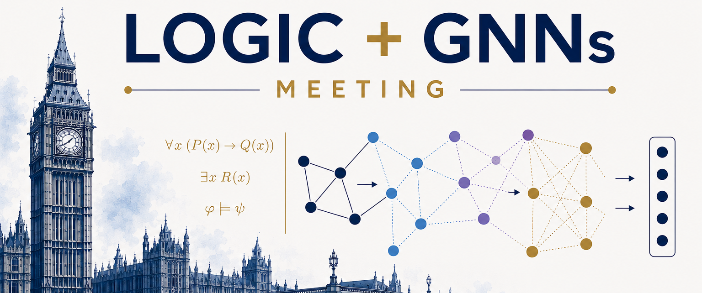

We are delighted to organise a meeting on logics and graph neural networks (GNNs) at Queen Mary University of London!

We observe a growing interest in combining logical and neural approaches, with GNNs proving to be a particularly well-suited AI architecture for such an integration. As a result, tight connections between logics and GNNs are attracting increasing attention, with current directions including:

- Expressive power of GNN architectures
- Verification of GNN models using formal methods
- Logical explainability and interpretability of GNNs
- Rule learning and knowledge discovery with GNN models
- Computational complexity of GNN architectures

The aim of this meeting is to bring together international experts in this growing, but still relatively young, area to discuss recent results, ongoing work, and future directions.

Talks are by invitation only, whereas attendance is open, but requires registration.

## Venue

Queen Mary University of London,
Mile End campus, London E1 4NS,

**Maths Lecture Theatre**, building number 4 [on the campus map](https://www.qmul.ac.uk/about/howtofindus/mileend/)

## Registration

TBA

## PROGRAM (subject to change)

## Thursday 25 June 2026

**9:45 – 10:00**  Opening: Welcome and Agenda

**10:00 – 11:00**  Session 1: ... (Chair: ...)
- Luca Geatti, Stefano Pessotto, Stefano Tonetta, *Safety and Liveness on Finite Words* 
- Arthur Jansen, Bart Kuijpers, *On the complexity of the realisability problem for visit events in trajectory sample databases*

**11:00 – 11:30**  Coffee break

**11:30 – 12:30**  Session 2: Time and Graphs (Chair: Carlo Combi)
- Curtis Dyreson, *Temporal GraphQL: A Tree Grammar Approach*
- Mateiu Rares-Ioan, Riccardo Dondi, Alexandru Popa, *Heuristics for covering timeline in temporal graphs* 

**12:30 – 14:00**  Lunch break

**14:00 – 15:00**  Invited Talk
- Michael  Zakharyaschev, *Separation and interpolation problems related to linear temporal logic LTL*

**15:00 – 15:30**  Coffee break

**15:30 – 16:30**  Session 3: Temporal Automata (Chair: Michael  Zakharyaschev)
- Giuseppe De Giacomo, Antonio Di Stasio, Gianmarco Parretti, *PDDL to DFA: A Symbolic Transformation for Effective Reasoning*
- Florian Bruse,  *Higher-Order Timed Automata and Tail Recursion* 

**16:30 – 17:30**  Session 4: Temporal Modelling Across Domains (Chair: Carlo Combi)
- Xiaojin Li, Yan Huang, Rashmie Abeysinghe, Zenan Sun, Hongyu Chen, Pengze Li, Xing He, Shiqiang Tao, Cui Tao, Jiang Bian, Licong Cui, Guo-Qiang Zhang,    *Temporal ensemble logic for integrative representation of the entirety of clinical trials* 
- Alexander Williams, Gregor Meehan, Stefan Lattner, Johan Pauwels, Mathieu Barthet, *Temporal Considerations in DJ Mix Information Retrieval and Generation* 

## Friday 26 June 2026

**09:30 – 10:30**  Invited Tutorial
- Nicola Gigante, *An introduction to first-order linear temporal logic*

**10:30 – 11:00**  Coffee break

**11:00 – 12:50**  Session 5: Temporal Logics and Uncertainty (Chair: Thierry Vidal)
- Livia Blasi, Luigi Bellomarini, Emanuel Sallinger, Markus Nissl, *The Temporal Vadalog System* 
- Eric Alsmann, Martin Lange,   *Metric Linear-Time Temporal Logic with Strict First-Time Semantics* 
- Luke Hunsberger, Roberto Posenato,    *A Better Algorithm for Converting an STNU into Minimal Dispatchable Form* 
- Lyris Xu, Luke Dickens, Fabio Aurelio D'Asaro,    *A Translation of Probabilistic Event Calculus into Markov Decision Processes* (short talk)
  
**12:50 – 14:00** Lunch break

**14:00 – 15:10**  Session 6: Spatio-temporal Reasoning (Chair: Florian Bruse)
- Arthur Jansen, Bart Kuijpers, *Solutions to the generalised alibi query in moving object databases*  
- Arthur Jansen, Bart Kuijpers,   *Visit probability in space-time prisms for moving object data* (short talk)
- Nassim Belmecheri, *QualiNet: Acquiring Bird's Eye View Qualitative Spatial Representation from 2D Images in Automated Vehicle Perception* (short talk)

## Organisation

- [Przemysław Wałęga](mailto:your-p.walega@qmul.ac.uk), School of Electronic Engineering and Computer Science, Queen Mary University of London
